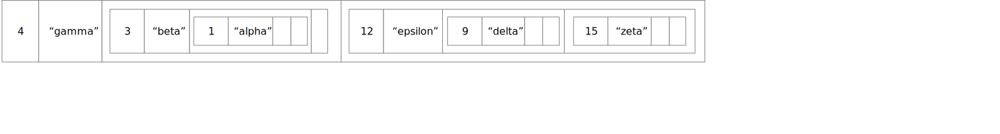

You've seen and written recursive functions before.  The same 
basic concepts apply in object-oriented programs with classes
and objects, but with a twist:  The data structure often 
has the same "shape" as the recursive function, and the 
parts of the recursive function are often divided between 
methods in different subclasses. 

## Review of Recursion

Recall that a recursive function is divided into one or 
more *base cases* and one or more *recursive* or *inductive* cases. 
Together these have a fairly standard structure.  In pseudocode:  

```
def recursive_function(value): 
    """We always check base cases first"""
    if base case applies: 
       do the base case and return
    elif another base case applies: 
       do the base case and return
    else 
       """Recursive case(s) follow"""
       break value into pieces p1, p2, ...
       r1 = recursive_function(p1)
       r2 = recursive_function(p2)
       ...
       return combination of value, r1, r2, ...
```       
        
For example, the classic *factorial* example can be written as 

```python
def classic_factorial(value: int) -> int:
    """We always check base cases first"""
    if value < 2:
        return 1
    else:
       """Recursive case(s) follow"""
       p1 = value - 1
       r1 = classic_factorial(p1)
       return value * r1
```

which we would typically simplify to 

```python
def fact(value: int) -> int:
    if value < 2:
        return 1
    return value * fact(value - 1)
```

We can see the same basic structure in a 
binary search.   Suppose we have a sorted table of (key, value) 
pairs that looks like this: 

```python
table = [(1, "alpha"), (3, "beta"), (4, "gamma"), (9, "delta"), (12, "epsilon")]
```

The table is sorted by key.  We can search it like this: 

```python
def bin_search(key: int, table: List[Tuple[int, str]]) -> str:
    return bin_search_range(key, table, 0, len(table) - 1)

def bin_search_range(key: int, table: List[Tuple[int, str]],
                    low: int, high: int) -> str:
    """Recursive binary search in range low..high inclusive"""

    """Base case 1: Key is not in table"""
    if low > high:
        return "No such value"

    mid = (high + low) // 2
    entry_key, entry_value = table[mid]

    """Base case 2: Key found at midpoint in table"""
    if entry_key == key:
        return entry_value

    if key < entry_key:
        """Recursive case 1: Key must be before midpoint, or absent"""
        return bin_search_range(key, table, low, mid - 1)

    else:
        """Recursive case 2: Key must be after midpoint, or absent"""
        return bin_search_range(key, table, mid + 1, high)
```
    

## Recursive Data Structures

A data structure can also have a recursive structure: Tuples can contain tuples, lists can 
contain lists, dicts can contain dicts, etc.   Instead of a simple list, we could make 
the table have four elements: 


where *smaller keys* and *larger keys* are themselves tables with the 
same form, lists within lists, so that we get 



In Python, the table could be represented as 

```python
alpha_tree = [4, "gamma",
                [3, "beta",
                    [1, "alpha", [], []],
                    []],
                [12, "epsilon",
                    [9, "delta", [], []],
                    [15, "zeta"], [], []]
              ]
```

We would typically visualize this structure not by 
drawing list cells within list cells, but by drawing the "nested in" 
relation as lines.  We call such a structure a *tree*, with the 
*root* of the tree at the top. 
Each entry in the tree is called a *node*.
Every node except the 
root is connected to a single *parent* above it. 
A node may be connected to one or more *children* 
below it.  A node without children is called a 
*leaf*, and other nodes are called *internal nodes*. 


In this diagram key 4 is at the root.  Keys 1, 9, and 15 are in leaves, 
and 4, 3, and 12 are internal nodes. 

Now we can rewrite our binary search as a search in the nested list structure, or tree:  

```python
def nested_list_search(key: int, table: list) -> str:
    """Table is [key, value, smaller keys, larger keys]"""
    log.debug(f"Search for {key} in {table}")
    """Base case 1: There are no keys"""
    if table == []:
        return "No such value"

    entry_key, entry_value, smaller, larger = table
    """Base case 2: Key is found"""
    if key == entry_key:
        return entry_value

    if key < entry_key:
        """Recursive case 1: Must be in the smaller keys"""
        return nested_list_search(key, smaller)
    else:
        """Recursive case 2: Must be in the larger keys"""
        return nested_list_search(key, larger)
```

Notice that this is almost the same logic as our binary search in a list. 
The differences are that now the data is "shaped like the algorithm".  
When we searched a sorted list, we divided the list into a middle element, 
a sublist of smaller elements, and a sublist of larger elements.  The nested 
list has already been divided up into a middle element (which appears in the 
first key and value), a sublist of smaller elements, and a sublist of larger 
elements.  Instead of calculating a midpoint, our `nested_search_list` just
follows the data structure. 

## Hierarchical Structure as Classes

We can implement the same logical structure using classes and objects.  Note that when 
we represented the tree using nested lists, we used empty lists to represent empty 
sets of entries with larger or smaller keys.  Using classes, we can instead 
create a distinct subclass for an empty table.  

We'll create an abstract base class for the tree structure, with a 
concrete subclass for a non-empty node and a concrete subclass for 
an empty node: 

```python
class GreekSearchTree:
    """An abstract base class for the table of Greek letters"""

    def __init__(self):
        raise NotImplementedError("Nope, can't do that")

class Node(GreekSearchTree):
    def __init__(self, key: int, value: str, smaller: GreekSearchTree, larger: GreekSearchTree):
        self.key = key
        self.value = value
        self.smaller = smaller
        self.larger = larger

class Empty(GreekSearchTree):
    def __init__(self):
        pass
```

With these classes we can build up the tree structure: 

```python
# The leaves
empty = Empty()  # I really only need one of these
alpha = Node(1, "alpha", empty, empty)
delta = Node(9, "delta", empty, empty)
zeta = Node(15, "zeta", empty, empty)
# The internal nodes
beta = Node(3, "beta", alpha, empty)
epsilon = Node(12, "epsilon", delta, zeta)
gamma = Node(4, "gamma", beta, epsilon)
# (4, gamma) is at the root
tree = gamma
```

What about a search method?  In the abstract 
base class, we will give a method definition with 
the header for the search method. 

```python
class GreekSearchTree:
    """An abstract base class for the table of Greek letters"""

    def __init__(self):
        raise NotImplementedError("Nope, can't do that")
    
    def search(self, key: int) -> str:
        """Return associated string or 'No such value'"""
        raise NotImplementedError("Concrete classes must override the search method")
```

We'll override that search method for the 
non-empty node class: 

```python
class Node(GreekSearchTree):
    def __init__(self, key: int, value: str, smaller: GreekSearchTree, larger: GreekSearchTree):
        self.key = key
        self.value = value
        self.smaller = smaller
        self.larger = larger

    def search(self, key) -> str:
        if self.key == key:
            return self.value
        if key < self.key:
            return self.smaller.search(key)
        else:
            return self.larger.search(key)
```

In this `search` method we see one of the base cases 
(when the key is found) and the recursive cases 
for searching in the subtree of smaller keys 
or the subtree of larger keys.  But where is the 
other base case?

The other case is not in this class at all, but is 
rather in the `search` method of the other concrete 
class: 

```python
class Empty(GreekSearchTree):
    def __init__(self):
        pass

    def search(self, key) -> str:
        return "No such value"
```

Here we see the one big difference between recursive 
functions and recursion in methods in a recursive 
structure of objects.   In the function, we always 
used some kind of decision (typically an `if` statement)
to distinguish the base cases and recursive cases.  
Typically the cases are distributed among
different subclasses, and part or all of the choice 
of which cases to execute are controlled by 
which kind of object the method is called in. 

Let's consider an example search for key 10.  
Initially we call the 'search' method on the 
root object, with key 4. 


The key 10 is greater than the key in that node, 
so the recursive part of the `search` method is 
invoked on `self.larger`, which is the subtree 
with key 12 at its root. 


Now key 10 is smaller than the key in the node, 
so it makes a recursive call to 
`self.smaller.search(key)`. 


Now key 10 is larger than the key in the node, 
so once again it makes a recursive call on 
`self.larger.search(key)`. 


This time we get the method `search` with 
class `Empty`.  We don't have to use an `if` 
statement to determine that this is a base case. 
We know it is a base case because that is the only 
case that this `Empty` node could be asked to handle! 

